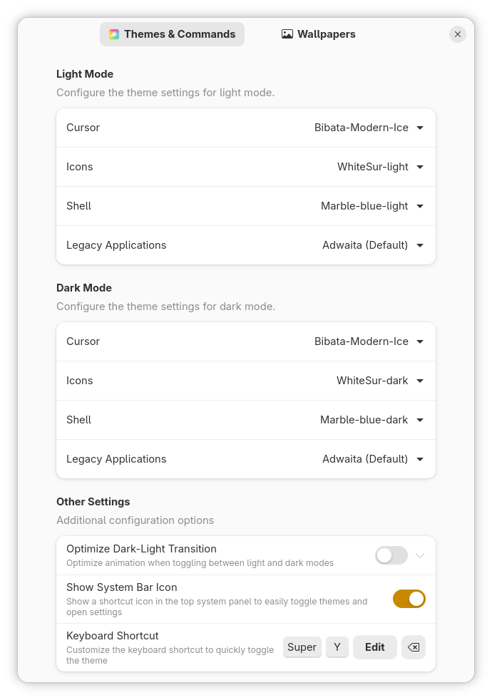
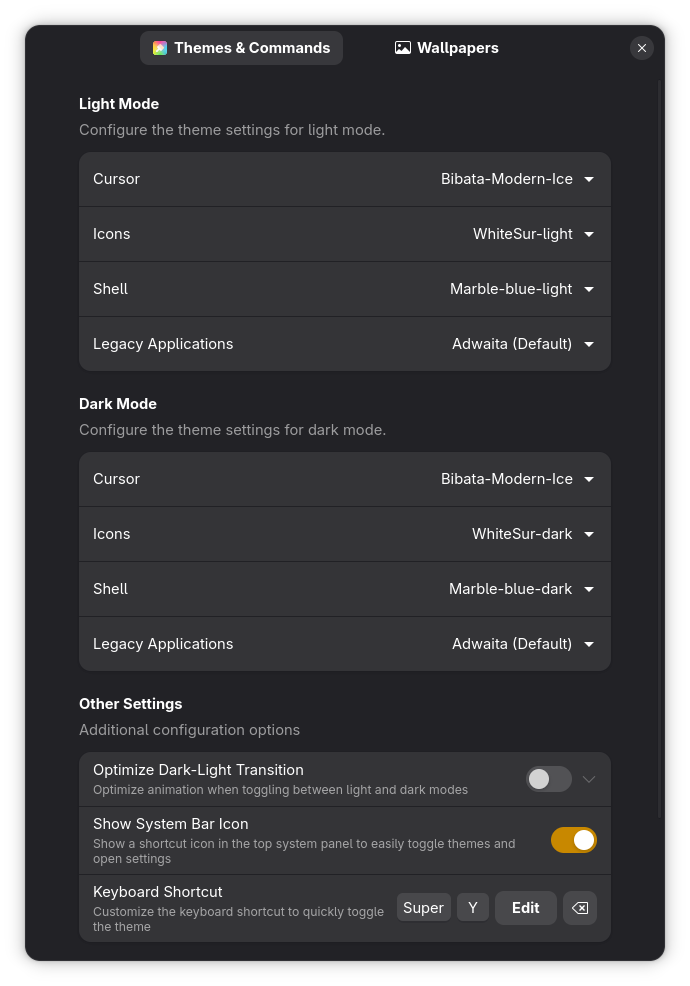
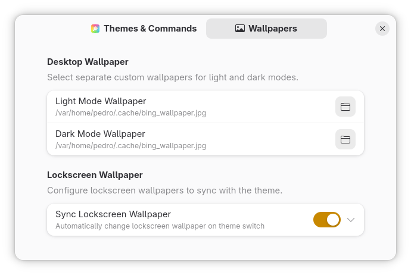
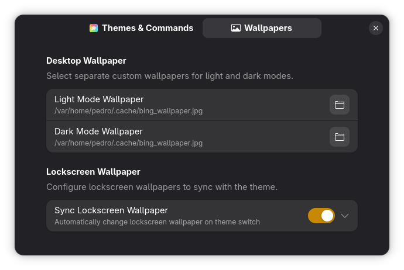

# DayNight Theme Sync

Automatically change theme styles when dark mode is enabled or disabled.

## Screenshots

### Themes & Commands Settings
| Light Mode | Dark Mode |
| --- | --- |
|  |  |

### Wallpapers Settings
| Light Mode | Dark Mode |
| --- | --- |
|  |  |

# Installation

Install the `DayNight Theme Sync` by running the following commands:

    wget https://github.com/phenrique-coder/DayNight-Theme-Sync/releases/latest/download/daynight-theme-sync@phenrique-coder.github.com.zip
    gnome-extensions install --force daynight-theme-sync@phenrique-coder.github.com.zip
    rm daynight-theme-sync@phenrique-coder.github.com.zip

# Building from source

You need to install `npm` or `yarn` for the dependencies.

Clone github repository && enter to the directory:

    git clone https://github.com/phenrique-coder/DayNight-Theme-Sync.git
    cd DayNight-Theme-Sync

Building with Node (if installed natively):

    npm install
    npm run build

Building with Docker:

If you don't have Node.js installed natively, you can use Docker to build the extension. A `docker-compose.yml` is provided.

    docker compose run --rm npm install
    docker compose run --rm npm run build

Installation:

    npm run install:extension

Testing:

    npm run dev:wayland

